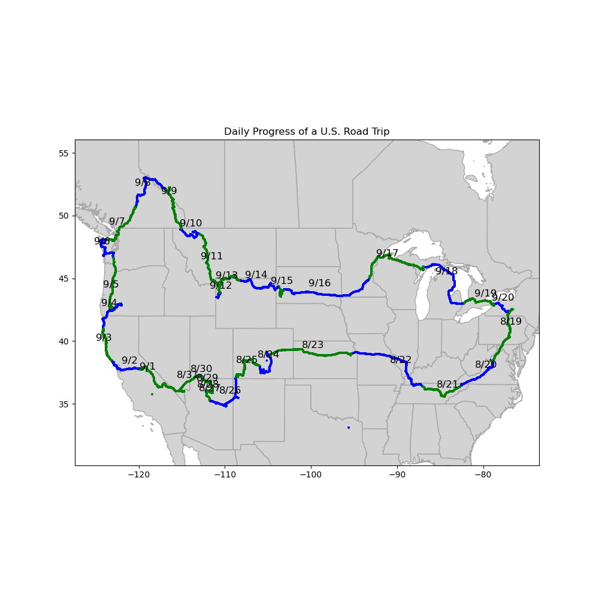

This is a small pet project that had been on my mind for years after a friend went on a month-long road trip across the U.S. Using the location data from his phone, I use geopandas to make several maps of his route and look at his average recorded speeds.

See the [notebook](https://github.com/andrewjtdunn/travel-maps/blob/main/map_travel_history.ipynb) for my analytic process and all of the maps.

The resulting map of his daily progress is below. The blue and green colors distinguish consecutive days. 
